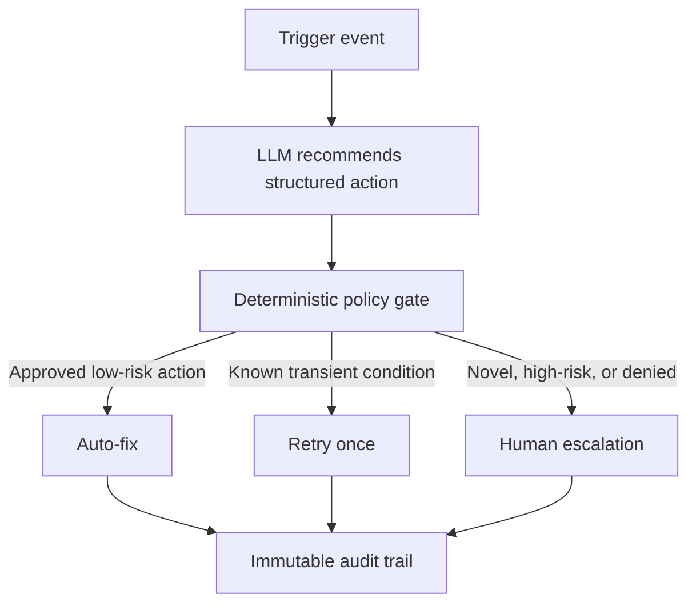

# AI-Governed Infrastructure Automation

**Daniel Mazzini · Principal Solutions Architect & Senior TPM · SolTelCo**

One governed automation framework applied across six network, cloud, and private-cloud infrastructure domains. Each scenario documents the problem, architecture, implementation pattern, ADR-style design decisions, accepted trade-offs, human approval boundaries, and AI-assisted recommendations that deterministic policy can authorize, retry, or escalate.

**Live interactive demo:** [danvzla.github.io/ai-governed-infrastructure-automation](https://danvzla.github.io/ai-governed-infrastructure-automation/)

> **Portfolio scope:** This is an architecture and capability showcase, not a deployed production system. All organizations, events, figures, timings, incident histories, percentages, and outcomes are illustrative, non-client examples.

---

## What this demonstrates

- Infrastructure and network architecture across six operational domains
- Python and Ansible automation patterns with API-driven integrations
- CI/CD workflows, policy-as-code guardrails, and validation stages
- Governed AI-assisted remediation with deterministic authorization and human escalation
- Architecture Decision Records with rationale and accepted trade-offs
- Deliberate boundaries between low-risk automation and high-risk human review
- Reusable platform patterns separated from scenario-specific tools and adapters

## Architecture pattern



The LLM recommends an action; it does **not** authorize execution. Controls outside the model evaluate resource risk, approved-action allowlists, verified precedent, maintenance windows, repeated failures, rollback availability, and required human approvals.

## Scenarios

| Scenario | Stack | Folder |
|---|---|---|
| VeloCloud SD-WAN: Branch Onboarding | VeloCloud Orchestrator, Python | [`scenarios/velocloud-sdwan`](scenarios/velocloud-sdwan) |
| Multi-Cloud VPC Provisioning | AWS, GCP, Azure | [`scenarios/multicloud-vpc`](scenarios/multicloud-vpc) |
| OpenStack VM & Service Provisioning | Heat, OpenStack SDK, Ansible | [`scenarios/openstack-vm-service`](scenarios/openstack-vm-service) |
| VCF Self-Service Catalog | VCF Automation, Blueprints | [`scenarios/vcf-self-service-catalog`](scenarios/vcf-self-service-catalog) |
| DNS & IPAM Automation | NetBox, Python, Ansible | [`scenarios/dns-ipam-automation`](scenarios/dns-ipam-automation) |
| Network Config Backup & Compliance | NAPALM, NETCONF, gNMI | [`scenarios/network-config-compliance`](scenarios/network-config-compliance) |

Each scenario folder contains:

- **`README.md`** — problem, methodology, architecture, design decisions, accepted trade-offs, deliberately manual controls, and agent decision rationale
- **Python automation** — validation, allocation, orchestration, or API integration logic
- **Ansible playbook** — configuration or provisioning tasks
- **Reference GitHub Actions workflow** — illustrative pipeline structure, not connected to live infrastructure
- **Supporting artifacts** — policies, inventories, templates, blueprints, and scripts; lightweight samples are identified as illustrative

## Shared remediation agent

The reusable decision pattern is shown in [`shared/remediation_agent.py`](shared/remediation_agent.py). It constrains model output to three recommendations:

- `auto_fix`
- `conditional_retry`
- `escalate`

A deterministic policy function—not model-generated confidence—decides whether an `auto_fix` recommendation is authorized. Unknown, high-risk, repeated, malformed, or failed decisions default to human escalation.

## Production safeguards not implemented in this portfolio

A production implementation would additionally require:

- Deterministic allowlists, resource risk tiers, blast-radius rules, and approval policies
- Secrets management, workload identity, least-privilege access, and environment isolation
- Input schema validation, telemetry sanitization, and prompt-injection defenses
- Idempotency, transactional state, concurrency locking, timeouts, bounded retries, and circuit breakers
- Pre-change snapshots, canary execution, rollback validation, and compensating actions
- Immutable audit logging, approval evidence, monitoring, and incident response integration
- Automated tests, dependency scanning, signed releases, and controlled environment promotion

## Repository structure

```text
.
├── index.html
├── README.md
├── .github/
│   └── workflows/
│       └── validate.yml
├── shared/
│   └── remediation_agent.py
└── scenarios/
    ├── velocloud-sdwan/
    ├── multicloud-vpc/
    ├── openstack-vm-service/
    ├── vcf-self-service-catalog/
    ├── dns-ipam-automation/
    └── network-config-compliance/
```

## Validation

The repository-level validation workflow performs safe static checks only. It does not connect to infrastructure or execute deployment actions. Checks include Python compilation, JSON parsing, YAML parsing, Ansible syntax validation where possible, and basic HTML verification.

## Honesty note

Tool references such as NAPALM, NetBox, VeloCloud, OpenStack, VCF Automation, Ansible, NETCONF, and gNMI are based on real public technologies. The specific problems, workflows, code excerpts, figures, and outputs are illustrative examples created to demonstrate architecture methodology and design thinking, not reproductions of client engagements or production deployments.

## Architecture and Governance

The portfolio separates AI-assisted recommendations from deterministic authorization and execution controls. Inputs are validated, the AI proposes a structured action, and policy outside the model evaluates risk, allowlists, maintenance windows, rollback availability, repeated failures, and required approvals. Unknown, high-risk, malformed, or denied actions default to human escalation.

The model does **not** independently authorize or execute production changes.

## Deterministic vs. AI-Generated Outputs

**Deterministic controls:** policy thresholds, action allowlists, risk tiers, approval requirements, CI/CD gates, retry and escalation rules, and rollback requirements.

**AI-assisted outputs:** remediation recommendations, risk explanations, change summaries, architecture guidance, and operational next steps.

## Validation and Quality Controls

Current controls include Python compilation, JSON/YAML parsing, Ansible syntax validation where available, basic HTML verification, structured recommendation values, and escalation by default for unknown or malformed decisions.

## Security and Data Handling

- The public portfolio does not connect to production infrastructure or execute live changes.
- Do not submit credentials, production configurations, customer data, private IP plans, or sensitive telemetry.
- Production deployments require managed secrets, workload identity, least privilege, RBAC, encryption, audit logging, input sanitization, and prompt-injection defenses.

## Testing

Current testing validates static structure and representative workflow behavior. Production use would require unit, policy, API-contract, idempotency, concurrency, dry-run, rollback, failure-injection, dependency-scanning, and approval-path tests.

## Limitations

This is an architecture showcase, not a deployed automation platform. Integrations, data, figures, and outcomes are illustrative. Production identity, observability, transactional state, and change execution are not implemented.

## Disclaimer

This project is provided for demonstration and educational purposes. Human review and environment-specific validation are required before operational use.

